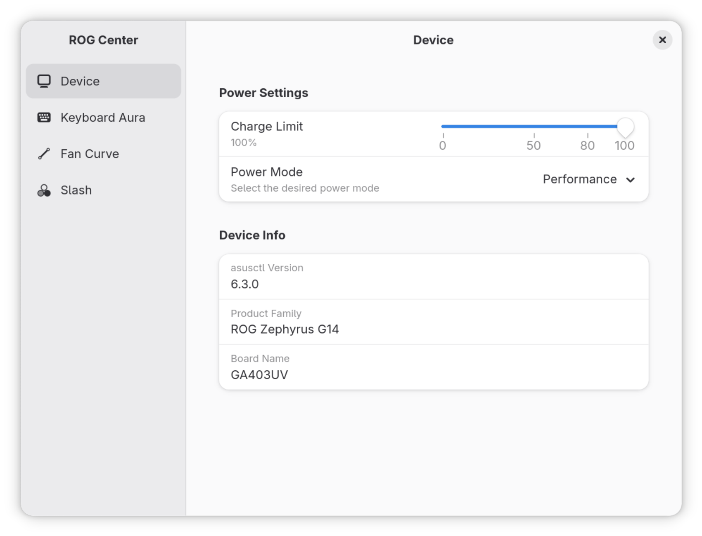

  

  # Armory

  A 3rd party control panel for ROG laptops on Linux, built with [GTKX](https://github.com/eugeniodepalo/gtkx) and [asusctl](https://gitlab.com/asus-linux/asusctl).

  

**🚧 NOTE: This project is in active development and largely vibe coded, so it is currently very sketchy and unstable.**

## Features

- [x] Device power profile control
- [x] Keyboard aura control
- [ ] Fan speed control
- [ ] Slash control

## Known Issues

- Only tested on ROG Zephyrus G14 (2024)
- Uses `asusctl` under the hood, so does not work in flatpak sandbox without proper permissions